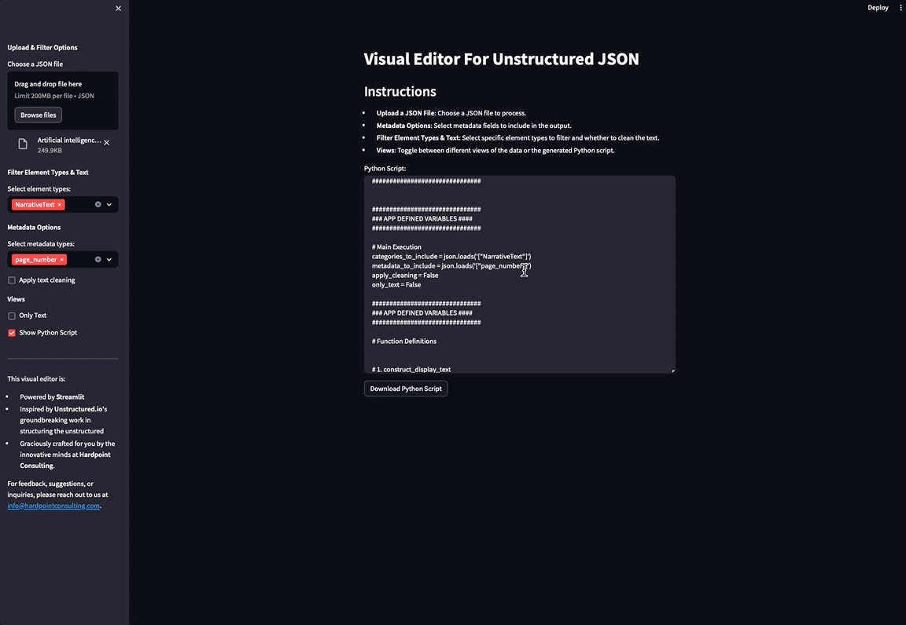

# Visual Editor for Unstructured JSON

### Overview
This Streamlit-based app provides a visual interface for processing JSON files generated from Unstructured.io. It enables users to interactively select element types and metadata for analysis and display. The app is designed for ease of use, catering to both data analysis and automation needs.


### Key Features
- **File Upload and Processing:** Allows for the uploading and processing of JSON files to extract relevant elements and metadata.
- **Interactive Element and Metadata Selection:** Users can choose from a list of predefined categories and metadata types for detailed analysis.
- **Flexible Display Options:** Offers the choice to view raw text or text annotated with selected metadata, alongside built-in cleaning functions for data refinement.
- **Script Generation:** Facilitates the creation of a Python script to automate the processing of either a single file or multiple files in a directory based on user-defined selections.
- **Download Functionality:** Provides the option to download the current display view as text or the generated Python script for offline use.


### How to Use the App
1. **Install Requirements:** First, ensure that all required packages listed in `requirements.txt` are installed. This can be done using `pip install -r requirements.txt`. Though not required, we reccomend the use of a virtual environment to avoid package conflicts.
2. **Run the App:** Start the app by navigating your terminal's working directory to the source folder (the folder that holds the app script) and then running `streamlit run app.py`.
3. **Interact with the App:**
    - **Upload a File:** Use the file upload option to upload the file you want to process. The app supports JSON files.
    - **Select Categories and Metadata:** On the app's sidebar, select the categories and metadata types you wish to include from the predefined lists.
    - **View Filtered Data:** The app will process the uploaded file and display the filtered elements and metadata based on your selections.
    - **Download Data:** If you wish to download the filtered text, use the provided download button.
<br>

**Example Of Loading And Viewing Text**

<br>

**Example Of Select Features**



### Step By Step Instructions

1. **Navigate Terminal To Folder:**
```bash
cd "/path/to_folder_that_holds_app"
```
2. **Create Virtual Environment:**
```bash
python3 -m venv env
```
3. **Activate The Virtual Environment:**
Run the app using Streamlit:
```bash
source env/bin/activate
```
4. **Install Necessary Packages:**
```bash
pip install -r requirements.txt
```
5. **Run The App:**
```bash
streamlit run app.py
```
6. **Stopping the App:**
   To stop the app, use the following keyboard shortcut in your terminal (on Mac OS):
 ```bash
 Control + C
 ```
7. **Deactivate The Environment:**
```bash
deactivate
```

## Looking For Help Or Further Reading?  

### **Need assistance getting started with unstructured.io or using this app?** <br>

* Please reach out with an email to info@hardpointconsulting.com <br>

### **Need more information on knocking this out yourself?** <br>

* For an open-source library that allows users to create structured data from unstructured text, please navigate to Unstructured.io's GitHub at: [Unstructured.IO's GitHub page](https://github.com/Unstructured-IO/unstructured).

* For their documentation and soon-to-be-released enterprise platform, please navigate to [Unstructured.IO's website](https://unstructured.io).


